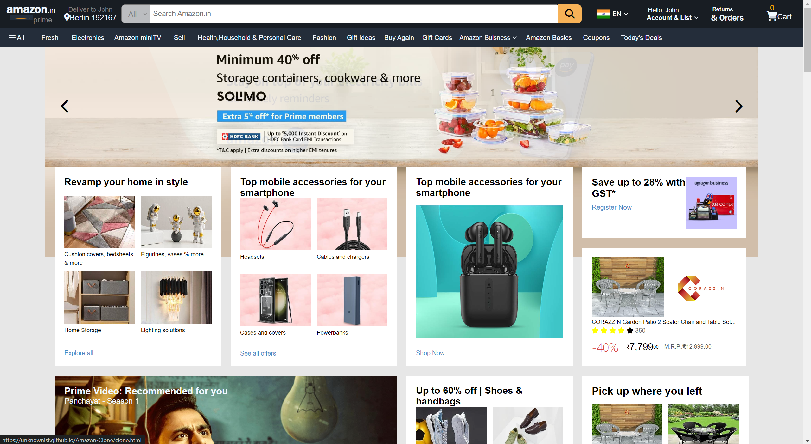

# Amazon Clone

## 📚 Overview

Welcome to the **Amazon Clone** project! 🎉 This repository showcases a static website design inspired by Amazon's online store, created using only HTML and CSS. This project demonstrates a clean, modern, and responsive e-commerce layout without any backend functionality.

> **Note:** This project is for **demonstration purposes only** and does not include any e-commerce features. Feel free to explore the design, learn from the code, or use it as a starting point for your own projects!

## 🌟 Features

- **Responsive Design:** Adapts beautifully across different devices and screen sizes.
- **Modern Layout:** Inspired by Amazon's design for a user-friendly shopping experience.
- **Static Content:** HTML and CSS only; no JavaScript or backend features.
- **Easy to Customize:** Modify styles and content to fit your needs.

## 🖼️ Screenshot

Here’s a preview of the Amazon Clone:



## 🚀 Getting Started

You can view the Amazon Clone by cloning this repository or accessing the live demo.

### 🔧 Local Setup

To view the Amazon Clone on your local machine:

1. **Clone the repository:**

   ```bash
   git clone https://unknownist.github.io/Amazon-Clone/clone.html

  ## 🌐 Live Demo
Check out the live demo of the Amazon Clone here (replace with the actual URL if you have one).
